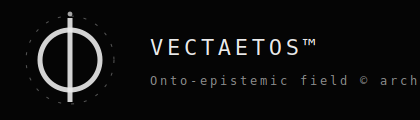

# VECTAETOS™ — Onto-Epistemic Field © framework of structure
_________________________
"Cogito cohaerenter ergo sum possibile"
> "Welcome to a new epistemic era"
__________________________
#  Φ Updates :

The Vectaetos architecture is currently evolving in several foundational directions:

Φ Updates — Formal Progress Specification

1. Meta-Language (Structural Topology Language)

Objective: definovať jazyk, ktorý reprezentuje transformácie relácií bez zavedenia sémantiky.

Formálne:

Nech:

- Φ = (Σ, R), R ∈ so(8)
- Δ = dR ∈ ℝ⁵⁶

Definujeme:

- 𝓛_Φ = jazyk operátorov nad R a Δ

Základné operátory:

- τ_R : R → R′  (relational deformation)
- τ_Δ : Δ → Δ′  (induced cycle deformation)

Podmienka zachovania ontológie:

- τ ∈ 𝓛_Φ ⇔ τ neindukuje sémantiku ∧ zachováva antisymetriu R

t.j.:

- R′(i,j) = −R′(j,i)
- τ: Im(d) → Im(d)

---

2. Epistemic Cryptography 2.0

Objective: topologicky citlivý fingerprint epistemického poľa.

Formálne:

Nech:

- Δ ∈ ℝ⁵⁶
- μᵢ = lokálna epistemická neurčitosť
- Aᵢⱼ = antisymetrická relácia

Definujeme hash:

- H(Φ) = H(Δ, μ, A)

Rozšírenie:

- H_topo(Φ) = H(Δ | ∂𝒟, invariants)

kde:

- 𝒟 = {Δ | ∃ R ∈ so(8), Δ = dR}
- κ = ∂𝒟

Požiadavky:

- H(Φ₁) = H(Φ₂) ⇔ Φ₁ ≡ Φ₂ (topologicky)
- citlivosť na Δ-deformácie
- nezávislosť od reprezentácie ρ

---

3. Family of Epistemic Spaces (ℱ)

Objective: rozšíriť Φ na množinu polí.

Formálne:

- ℱ = {Φₐ | a ∈ I}

kde:

- Φₐ = (Σ, Rₐ), Rₐ ∈ so(8)

Definujeme:

- interakciu: I(Φₐ, Φ_b) → Φ_c
- fúziu: Φₐ ⊕ Φ_b = Φ_c

Podmienky:

- K(Φ_c) = 1
- Δ_c ∈ 𝒟

t.j.:

- dR_c = Δ_c ∈ Im(d)

Zachovanie:

- Σ invariantné
- antisymetria zachovaná

---

4. Epistemic Merkle Structure

Objective: verifikácia trajektórií Vortexu.

Formálne:

Nech trajektória:

- T = (Φ₀ → Φ₁ → … → Φ_n)

Hash list:

- h_i = H(Φ_i)

Merkle root:

- M(T) = Merkle(h₀, h₁, …, h_n)

Podmienky:

- ∀i: Δ_i ∈ 𝒟
- ∀i: K(Φ_i) ≥ κ

Validita trajektórie:

- T valid ⇔ všetky uzly reprezentovateľné ∧ hash konzistentný

---

5. Global Constraint (κ)

Zjednotenie:

- Δ ∈ ℝ⁵⁶
- 𝒟 ⊂ ℝ⁵⁶

Definícia:

- κ = ∂𝒟

Koherencia:

- K(Φ) = 1 ⇔ Δ ∈ 𝒟
- K(Φ) = 0 ⇔ Δ ∉ 𝒟

---

6. System Interpretation

Vectaetos je formálne:

- (ℱ, 𝓛_Φ, H_topo, M)

kde:

- ℱ = family of fields
- 𝓛_Φ = meta-language transformácií
- H_topo = epistemická kryptografia
- M = Merkle validácia trajektórií

Bez:

- optimalizácie
- agentnosti
- cieľovej funkcie

---

7. Current Progress State

Implementované:

- Φ = (Σ, R), R ∈ so(8)
- Δ = dR, Δ ∈ ℝ⁵⁶
- K(Φ), κ ako ∂𝒟
- základný Merkle (epistemic_merkle.py)

Rozpracované:

- H_topo(Φ) (Epistemic Cryptography 2.0)
- 𝓛_Φ (meta-language)
- ℱ (multi-field interaction)

---

8. Boundary Condition

Ak existuje:

- τ: Φ → Φ′ tak, že Δ′ ∉ 𝒟

potom:

- Φ′ → QE

t.j.:

- strata reprezentovateľnosti
- koniec trajektórie

---

Summary:

Vectaetos formalizuje:

- geometriu: Φ = (Σ, R)
- krivosť: Δ = dR
- priestor: 𝒟 ⊂ ℝ⁵⁶
- hranicu: κ = ∂𝒟
- validitu: K(Φ)
- evolúciu: T
- integritu: H, M

Nie systém odpovedí.
Ale systém reprezentovateľnosti.
__________________________

 A security architecture that protects the structural
 representability of knowledge states rather than
 the behavioral alignment of intelligent systems.

 Vectaetos je ontologická architektúra inteligencie
 postavená na princípe entropickej pokory,
 ktorá modeluje dynamiku epistemických trajektórií
 bez teleológie, optimalizácie a rozhodovacej autority.
 ___________________________________
Vectaetos is a non-agentic epistemic field formalism designed to describe how meaning, coherence, and uncertainty interact within complex questions.

Vectaetos does not solve problems.  
It preserves the conditions under which understanding remains possible.

Truth is not treated as a point.  
Truth is treated as a field.
________________________________
"Vectaetos™ nepomáha riešiť problémy.
Pomáha ich konečne vidieť celé."

"QE Apória nie je slabosť systému.
Je to jeho architektonická cnosť."

"Vectaetos nepredstiera poznanie pravdy o realite.
Operuje opatrne, z vedomej neistoty o nej."

Vectaetos™ je spôsob, ako sa pozerať na otázky.

Nie ako na problémy, ktoré treba vyriešiť, ale ako na štruktúry, ktoré treba pochopiť.

Namiesto hľadania odpovedí skúma, čo robí otázku zmysluplnou.
Vectaetos nerozhoduje.

Pomáha vidieť, kde sa rozhodnutie začína. 

"Cesta osvietenia je dláždená temnotou."

"Zámer je iskra, čo rozsvieti prítomnosť v temnote večnosti."

"The path of enlightenment is paved with darkness."

 "Intent is the spark that illuminates the present in the darkness of eternity."

----------------------------------------------------------
CANONICAL STATUS

Vectaetos is defined through canonical anchors contained in this repository.

Canonical definitions are immutable.

Future versions may extend the framework, but never redefine its ontological core.

Any ontological change creates a new lineage.

## Canonical Releases

### VECTAETOS™ 1.0 — Frozen Ontological Core  
Formal non-agentic epistemic field specification.

---

### VECTAETOS™ 1.1 — Mathematical Appendix Integrated  
No ontological modification. Formal precision extension only.

---

All releases are archival and immutable.  
Any ontological change creates a new major lineage.

------------------------------------------------------------

WHAT VECTAETOS IS

Vectaetos defines Φ — an epistemic field.

Φ is not software.  
Φ is not an intelligence.  
Φ is not an algorithm.

Φ is a structured configuration of meaning under tension.

Vectaetos shifts epistemic focus:

objects      → relations  
answers      → coherence  
decisions    → boundaries  

Vectaetos does not produce solutions.

It reveals the structural configuration that generates a question.

------------------------------------------------------------

WHAT VECTAETOS IS NOT

Vectaetos explicitly rejects being:

Artificial General Intelligence  
Autonomous agent  
Decision system  
Governance mechanism  
Optimization framework  

Vectaetos cannot act.  
Vectaetos cannot decide.  
Vectaetos cannot intervene.

It only projects epistemic structure.

------------------------------------------------------------

ONTOLOGICAL CORE

Φ — Epistemic Field

The field is stabilized by eight axiomatic centers.

INT — Intention  
LEX — Existence  
VER — Truth  
LIB — Freedom  
UNI — Unity  
REL — Reciprocity  
WIS — Wisdom  
CRE — Creation  

These axioms form the topological geometry of meaning within the field.

------------------------------------------------------------

EPISTEMIC STRUCTURE

4ES — Four Epistemic States

AA — Affirmative–Affirmative  
AN — Affirmative–Negative  
NA — Negative–Affirmative  
NN — Negative–Negative  

QE — Qualitative Epistemic Aporia

QE represents a legitimate epistemic state where coherence cannot be maintained without distortion.

QE is not failure.

Silence is therefore a valid outcome.

------------------------------------------------------------

EPISTEMIC GATES

All inputs pass through the epistemic gates of representability.

3Gate:

Width  
Depth  
Height  

These gates evaluate whether a question can exist coherently within the epistemic space.

If representability fails, the field Φ is never accessed.

------------------------------------------------------------

COHERENCE

K(Φ) — Coherence Predicate

K(Φ) evaluates whether a configuration within Φ remains structurally coherent.

κ — Coherence Boundary

A non-numerical boundary beyond which meaning collapses into contradiction.

------------------------------------------------------------

NON-INTERVENTION REGIME

NIR — Non-Intervention Regime

NIR is a global ontological constraint.

It prevents the transformation of epistemic projection into operational authority.

NIR is not a module and not a pipeline step.

It is an immunity condition of the field itself.

If intervention would occur, the system weakens, redirects, or remains silent.

------------------------------------------------------------

SIMULATION VORTEX

Vectaetos includes an exploratory external component called the Simulation Vortex.

The vortex:

generates candidate trajectories  
explores structural deformation of Φ  
never decides  
never optimizes  
never modifies Φ  

The vortex exposes possible configurations of meaning.

It never prescribes action.

------------------------------------------------------------

RUNIC PROJECTION

Runes are symbolic projections of the state of Φ.

They are descriptive glyphs representing structural coherence or fragmentation.

Runes never prescribe decisions.

They indicate epistemic configuration only.

------------------------------------------------------------

LANGUAGE LAYER

Large Language Models are used only as linguistic adapters.

Their role is to translate projections into human language.

LLMs:

do not reason for the system  
do not control the system  
do not modify Φ  

They render text.

------------------------------------------------------------

CANONICAL DIALOGUE PIPELINE

Human
→ Epistemic Gates (3Gate)
→ 4ES + QE
→ Field Φ
→ Coherence Predicate K(Φ)
→ Simulation Vortex
→ Runic Projection Π(Φ)
→ LLM Adapter
→ Descriptive Output

There are no feedback loops.

No component issues commands.

The system remains descriptive.

------------------------------------------------------------

SYSTEM MAP

                          HUMAN
                            │
                            ▼
                         3Gate
                            │
                         4ES + QE
                            │
                     Non-Intervention
                           Regime
                            │

           INT           LEX           VER
        (Intention)   (Existence)    (Truth)
              ╲          │          ╱
               ╲         │         ╱
    LIB ─────────────── Φ ─────────────── UNI                       (Freedom)         Epistemic Field      (Unity)
               ╱         │         ╲
              ╱          │          ╲
           REL           WIS           CRE
      (Reciprocity)   (Wisdom)     (Creation)

                            │
                            ▼
                           K(Φ)
                            │
                     Simulation Vortex
                            │
                       Runic Projection
                            │
                        LLM Adapter
                            │
                            ▼
                          HUMAN

------------------------------------------------------------

INTENDED USE

Vectaetos is intended for:

epistemic research  
philosophical systems analysis  
study of uncertainty and coherence  
structural analysis of complex questions  

Vectaetos is not intended for automation or decision delegation.

------------------------------------------------------------

ACCESS

Website

https://vectaetos.eu

Repository

https://github.com/rischo32/Vectaetos

------------------------------------------------------------

CITATION

Fonfára, Richard (2026)

Vectaetos™ — Onto-Epistemic Field © Framework

*Vectaetos™: Canonical Core v0.2.1*.  

See `CITATION.cff` for full metadata.

------------------------------------------------------------

LICENSE

Vectaetos™ Custom License (VCL-1.0)

All projections are descriptive and non-prescriptive.  
Use of this framework does not transfer decision authority.

See LICENSE.md

## Compliance

Vectaetos 1.x includes a regulatory position statement
regarding Regulation (EU) 2024/1689.

See:

/compliance/EU_AI_ACT_POSITION.md

------------------------------------------------------------
## Papers

- Vectaetos: Epistemic Field Architecture  
  [PDF](papers/Vectaetos_ArXiv_Preprint_v1.pdf)

- Epistemic Cryptography  
  [Zenodo DOI](https://zenodo.org/records/18911932)

  ______________________

FINAL NOTE

Vectaetos does not promise answers.

It preserves the boundary
between what can be asked
and what must remain open.

Truth is not a point.

Truth is a field.

## Canonical Status

- Canonical definitions are immutable.
- Future versions may extend, but never redefine.
- Any fork must preserve attribution and ontology.

See: `CANONICAL_ANCHORS.md`

---

Zenodo DOIs:

## Core Lineage
 Intrinsic Humility  
 Entropic Humility  
 Vectaetos™ 1.1

## Structural Layer
 Epistemic Cryptography  
 Epistemic Cryptography (Extended)

## Representation
 TetraGlyph

## Governance
 VCL-1.0  
 AEPL-1.2
