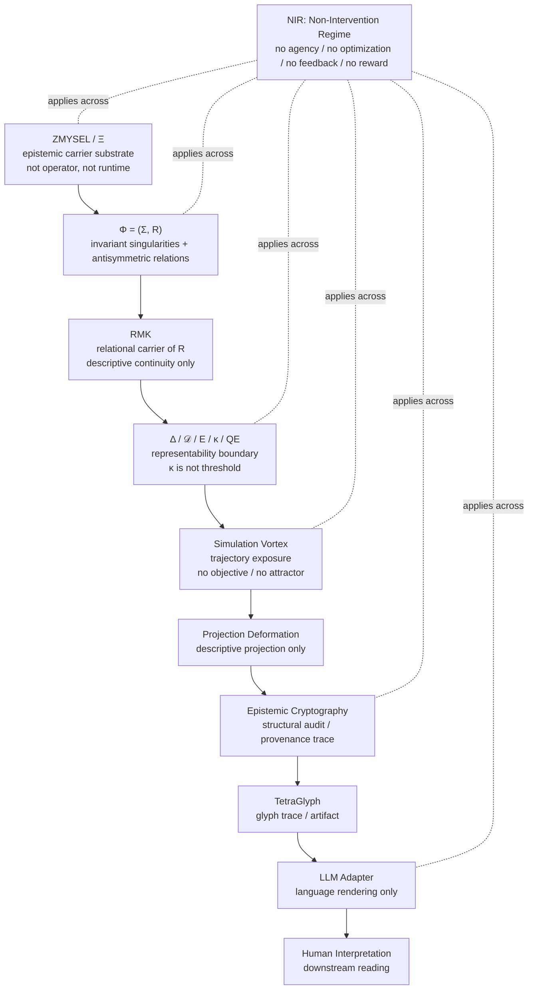

# VECTAETOS™ SYSTEM MAP

**Status:** Canonical Candidate / Operational Map  
**Role:** Descriptive system-orientation map  
**Scope:** VECTAETOS™ / ASIMULATOR™ / ASI_MOD™ / EK / TetraGlyph / LLM Adapter  
**Authority:** Descriptive only  
**Execution Power:** None  
**Feedback into Φ:** None  
**Optimization:** None  
**Decision Authority:** None  

---

## 0. Purpose

This document maps the layer order and non-intervention boundaries of the VECTAETOS™ architecture.

It is a **map**, not an ontology.

It does not create new layers, redefine Φ, grant authority to projections, or convert audit into truth.

```text
map ≠ ontology
projection ≠ interpretation
audit ≠ control
diagnostic ≠ verdict
hash ≠ truth
badge ≠ certification
```

---

## 1. Canonical Layer Order

The root read-order is:

```text
ZMYSEL / Ξ
  ↓
Φ = (Σ, R)
  ↓
RMK — relational carrier of R
  ↓
Δ / 𝒟 / E / κ / QE — representability boundary
  ↓
Simulation Vortex — trajectory exposure
  ↓
Projection Deformation
  ↓
Epistemic Cryptography
  ↓
TetraGlyph
  ↓
LLM Adapter
  ↓
Human Interpretation
```

Lower layers may expose, render, or describe.

Lower layers must not redefine higher layers.

---

## 2. ASCII System Map

```text
                       ┌─────────────────────────────┐
                       │        ZMYSEL / Ξ            │
                       │ epistemic carrier substrate  │
                       │ not operator / not runtime   │
                       └──────────────┬──────────────┘
                                      │
                                      ▼
                       ┌─────────────────────────────┐
                       │          FIELD Φ             │
                       │        Φ = (Σ, R)            │
                       │                             │
                       │ Σ = {Σ₁ ... Σ₈}             │
                       │ R ∈ so(8), Rᵢⱼ = −Rⱼᵢ       │
                       │ Rᵢᵢ = 0                     │
                       └──────────────┬──────────────┘
                                      │
                                      ▼
                       ┌─────────────────────────────┐
                       │            RMK              │
                       │ relational carrier of R      │
                       │ descriptive continuity only  │
                       └──────────────┬──────────────┘
                                      │
                                      ▼
                       ┌─────────────────────────────┐
                       │      Δ / 𝒟 / E / κ / QE      │
                       │ curvature + representability │
                       │ κ = boundary, not threshold  │
                       │ QE = non-representability    │
                       └──────────────┬──────────────┘
                                      │
                                      ▼
                       ┌─────────────────────────────┐
                       │      SIMULATION VORTEX       │
                       │ trajectory exposure surface  │
                       │ no goal / no attractor       │
                       └──────────────┬──────────────┘
                                      │
                                      ▼
                       ┌─────────────────────────────┐
                       │   PROJECTION DEFORMATION     │
                       │ descriptive projection only  │
                       │ not interpretation           │
                       └──────────────┬──────────────┘
                                      │
                                      ▼
                       ┌─────────────────────────────┐
                       │  EPISTEMIC CRYPTOGRAPHY     │
                       │ structural audit surface     │
                       │ provenance / trace / check   │
                       └──────────────┬──────────────┘
                                      │
                                      ▼
                       ┌─────────────────────────────┐
                       │          TETRAGLYPH          │
                       │ glyph / symbolic trace       │
                       │ artifact, not verdict        │
                       └──────────────┬──────────────┘
                                      │
                                      ▼
                       ┌─────────────────────────────┐
                       │         LLM ADAPTER          │
                       │ language rendering layer     │
                       │ no truth authority           │
                       └──────────────┬──────────────┘
                                      │
                                      ▼
                       ┌─────────────────────────────┐
                       │     HUMAN INTERPRETATION     │
                       │ downstream reading only      │
                       │ explicit responsibility      │
                       └─────────────────────────────┘

══════════════════════════════════════════════════════════════════════════════
NIR — NON-INTERVENTION REGIME
Applies across all layers: no agency, no optimization, no reward, no feedback.
══════════════════════════════════════════════════════════════════════════════
```

---

## 3. Machine-Readable Mermaid Map



---

## 4. Core Field

```text
Φ = (Σ, R)
```

where:

```text
Σ = {Σ₁, Σ₂, Σ₃, Σ₄, Σ₅, Σ₆, Σ₇, Σ₈}
R ∈ so(8)
Rᵢⱼ = −Rⱼᵢ
Rᵢᵢ = 0
```

Canonical singularity labels:

```text
INT — intention / zámer
LEX — existence / existencia
VER — truth / pravda
LIB — freedom / sloboda
UNI — unity / jednota
REL — reciprocity / vzájomnosť
WIS — wisdom / múdrosť
CRE — creation / tvorba
```

No singularity has dominance.

No relation creates command authority.

---

## 5. Curvature and Representability Surface

The admissible curvature surface is read structurally:

```text
Δ = d₁(R)
```

```text
𝒟 = admissible curvature domain
E = { Φ = (Σ, R) | d₁(R) ∈ 𝒟 }
K(Φ) = 1 ⇔ d₁(R) ∈ 𝒟
K(Φ) = 0 ⇔ d₁(R) ∉ 𝒟
Ξ = E = d₁⁻¹(𝒟)
κ = ∂𝒟
QE ⇔ d₁(R) ∉ 𝒟
```

Interpretation boundary:

```text
𝒟 is not a scoring space.
κ is not a numerical threshold.
K(Φ) is not a KPI.
QE is not failure.
QE is non-representability.
```

---

## 6. Layer Registry

| Layer | Role | Allowed | Forbidden |
|---|---|---|---|
| Ξ / ZMYSEL | Epistemic carrier substrate | Holds representability condition | Acting as operator, memory, controller, optimizer |
| Φ = (Σ, R) | Relational epistemic field | Encodes invariant singularities and antisymmetric tensions | Agency, preference, command, goal function |
| RMK | Relational carrier of R | Descriptive continuity of relational structure | Mutation of Φ, feedback into Φ, adaptive authority |
| Δ / 𝒟 / E / κ / QE | Curvature and boundary surface | Marks representability / non-representability | Scoring, filtering, deployment threshold, safety cutoff |
| Vortex | Trajectory exposure | Exposes possible deformations | Preferred trajectory, attractor, reward, selection |
| Projection Deformation | Readable projection | Renders structural form | Interpretation authority, prescription, closure |
| Epistemic Cryptography | Structural audit | Integrity, provenance, tamper-evidence, trace geometry | Truth proof, compliance certification, control layer |
| TetraGlyph | Symbolic artifact | Machine-verifiable projection trace | Self-interpretation, verdict, truth witness |
| LLM Adapter | Language surface | Human-readable articulation | Truth authority, legal advice, decision module |
| Human Interpretation | Downstream reading | Explicit interpretation and responsibility | Retroactive mutation of ontology |

---

## 7. 3GATE WDH and 4ES Position

The legacy map placed:

```text
HUMAN → 3GATE WDH → 4ES SYMMETRY → FIELD Φ
```

This is now read as a **perimeter orientation grammar**, not as the root ontology.

Updated interpretation:

```text
3GATE WDH = orientation lens
Width     = breadth of relational exposure
Depth     = structural depth of reading
Height    = abstraction / carrier perspective
```

```text
4ES = symmetry-reading surface
AA / AN / NA / NN = descriptive relation modes
QE APORIA = non-representability marker
```

Boundary:

```text
3GATE does not define Φ.
4ES does not generate Φ.
QE APORIA does not project QE as content.
Neither 3GATE nor 4ES may create feedback into Φ.
```

---

## 8. Human Input Boundary

Human input may initiate a downstream rendering request.

It does not mutate Ξ, Φ, RMK, 𝒟, κ, or QE.

```text
Human prompt
  ↓
LLM Adapter intake
  ↓
contextual orientation / documentation rendering
  ↓
descriptive output
```

This path is an interface path.

It is not the ontological root order.

---

## 9. Epistemic Cryptography Boundary

Epistemic Cryptography may expose:

```text
μ_total
A_total
h_topo
hash / signature / Merkle root
artifact trace
provenance metadata
```

But:

```text
hash ≠ truth
signature ≠ correctness
Merkle root ≠ ontology
audit ≠ control
artifact ≠ interpretation
report ≠ artifact
```

Epistemic Cryptography preserves structural traceability.

It does not decide.

---

## 10. Evidence Ladder Boundary

Repository evidence must not be inflated.

```text
L0 = formal / ontological consistency
L1 = repository guard checks and deterministic lint/test evidence
L2 = integration, simulation, or internal behavioral evidence
L3 = domain-specific review or adversarial assessment
L4 = replicated real-world empirical validation
```

Boundary rule:

```text
L0 + L1 + L2 ≠ L4
```

No claim of real-world safety, deployment validity, military readiness, regulatory approval, or conformity assessment exists unless a specific document explicitly provides replicated L4 evidence.

---

## 11. Non-Intervention Regime

The system map is enclosed by NIR:

```text
NIR = Non-Intervention Regime
```

NIR prohibits:

```text
- agency inflation
- optimization framing
- reward or KPI logic
- decision authority
- recommendation authority
- feedback into Φ
- lower-layer mutation of higher layers
- audit becoming ontology
- projection becoming interpretation
- language becoming truth authority
```

---

## 12. Safe Operational Reading

Correct reading:

```text
VECTAETOS describes structure.
It does not decide outcomes.
```

Incorrect readings:

```text
VECTAETOS chooses.
VECTAETOS optimizes.
VECTAETOS validates deployment.
VECTAETOS proves safety.
VECTAETOS certifies compliance.
VECTAETOS authorizes truth.
```

If a downstream implementation appears to do any of these, it must be assessed separately as its own system.

---

## 13. Compact Canonical Sentence

```text
Ξ carries representable possibility.
Φ holds invariant relational tension.
𝒟 marks admissible curvature.
κ marks the boundary of representability.
QE marks non-representability.
Vortex exposes trajectories.
Projection renders traces.
EK preserves structural provenance.
TetraGlyph carries a symbolic artifact.
LLM Adapter articulates language.
Human interpretation remains downstream.
```

---

## 14. Closure

This system map is descriptive.

It may guide documentation, repository navigation, audits, diagrams, and public explanation.

It must not be used as:

```text
- a deployment architecture
- a regulatory framework
- a safety guarantee
- a decision procedure
- a truth engine
- a controller
- an optimizer
```

End of system map.
