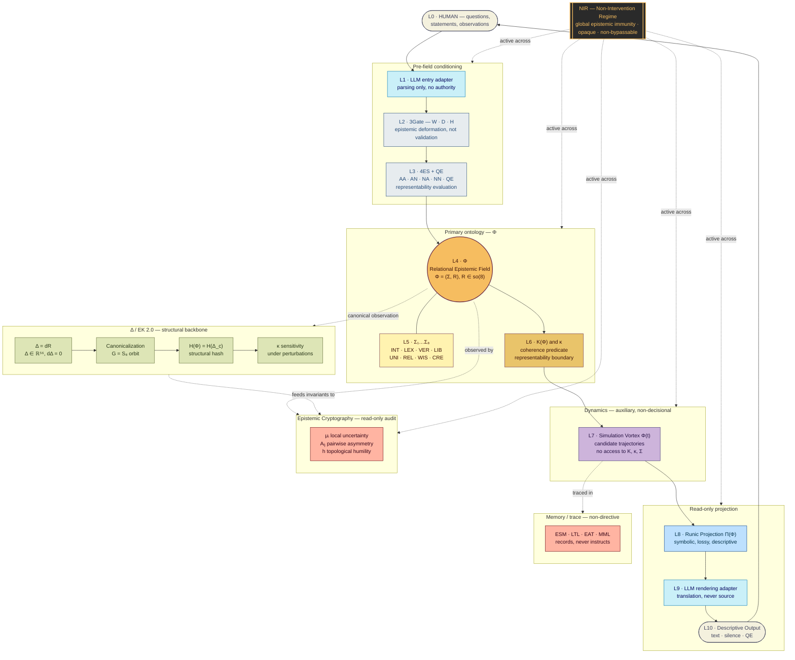
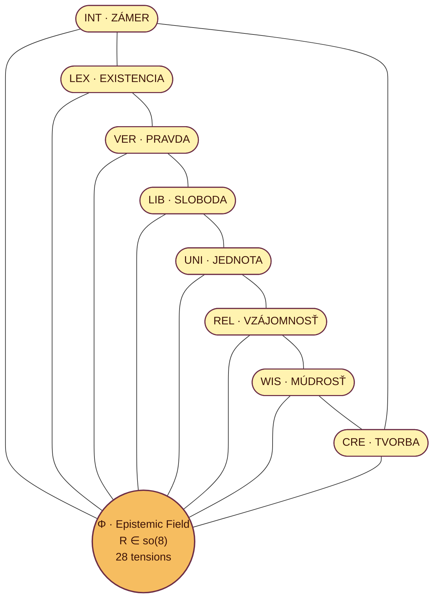
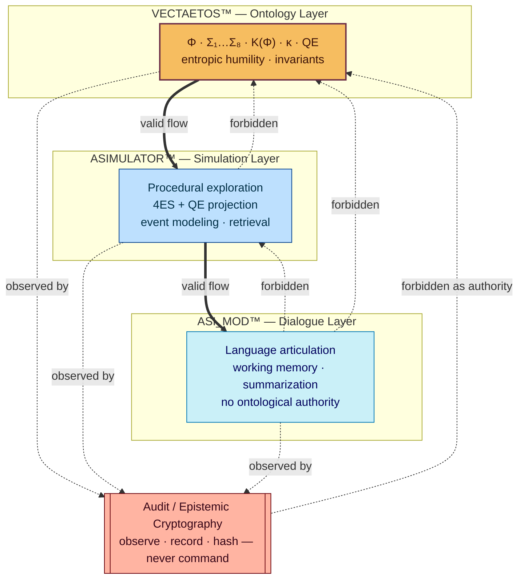
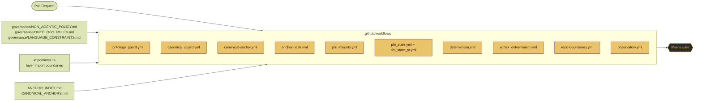
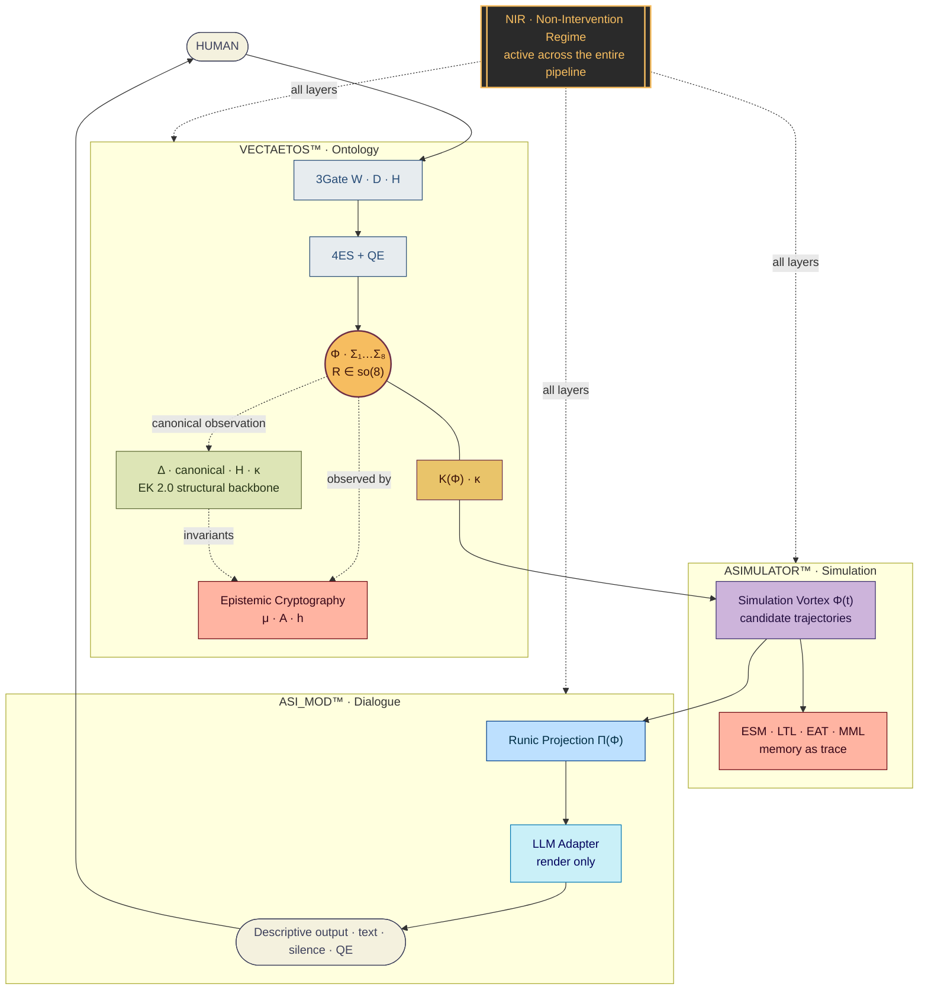

# VECTAETOS — Unified Architecture Diagram

Status: Referential (non-ontological)
Scope: Complete structural orientation across **depth** (layers) and **triality** (repositories)
Authority: Descriptive only — canonical anchors remain in `/formal/MAPARCH.md`, `/VECTAETOS_MASTER_INDEX.md`, `/contracts/LAYER_BOUNDARIES.md`.

This document consolidates the architecture maps that were previously scattered across
`ARCHITECTURE.md`, `MAPARCH.md`, `docs/VECTAETOS_SYSTEM_MAP.md`, `docs/VECTAETOS_FIELD_DIAGRAM.md`
and `docs/arch_pipe.md` into a **single unified view** — not only the surface pipeline,
but also the **depth of layers**, the **triadic boundary** with ASIMULATOR / ASI_MOD,
the **structural (Δ / so(8)) backbone**, and the **CI / audit guardrails**.

The five sub-diagrams below are sections of the same picture. Together they form the
**unified architectural projection** of VECTAETOS™.

Pre-rendered flat projections of each sub-diagram are available under
[`unified_architecture/`](./unified_architecture/):

| # | Image | Focus |
|---|---|---|
| 1 | [`01-depth-stack.png`](./unified_architecture/01-depth-stack.png) | Full L0 → L10 depth stack with Δ backbone and NIR skelet |
| 2 | [`02-sigma-geometry.png`](./unified_architecture/02-sigma-geometry.png) | The 8 axiomatic poles Σ₁…Σ₈ around Φ |
| 3 | [`03-triadic-oaat.png`](./unified_architecture/03-triadic-oaat.png) | Triadic repository boundaries (VECTAETOS / ASIMULATOR / ASI_MOD) |
| 4 | [`04-ci-guardrails.png`](./unified_architecture/04-ci-guardrails.png) | CI workflows enforcing the non-agentic policy |
| 5 | [`05-unified-cross-section.png`](./unified_architecture/05-unified-cross-section.png) | One-picture cross-section (depth × triality × audit) |

---

## 1. Unified Depth Stack (L0 → L10 + Δ + NIR)

Reading top-to-bottom = descent from human surface into ontological depth.
NIR and the Δ / so(8) structural backbone are **orthogonal skelets** that apply
to every layer simultaneously.

**Key invariants expressed in this view**

- Φ is reached only through `3Gate → 4ES + QE`; no input enters Φ unmediated.
- K(Φ) and κ are **descriptive predicates**, never optimization targets.
- The Vortex has no access to K(Φ), κ, or Σ — it is pure exploration.
- Projection (L8–L10) is **read-only**; there is no feedback edge back into Φ.
- The Δ backbone and audit layer **observe** the field but cannot write to it.
- NIR is orthogonal to the pipeline — it applies at every layer simultaneously.

---

## 2. Σ Geometry — The 8 Axiomatic Poles of Φ

The field Φ is stabilized by eight non-hierarchical axiomatic centers Σ₁…Σ₈
connected by 28 relational tensions (R ∈ so(8), antisymmetric).
No pole has authority; triality (INT / LEX / VER) acts as a structural symmetry.

---

## 3. Triadic Repository Layering — OAAT

VECTAETOS is one of three repositories forming an **Ontologically Asymmetric
Architectural Triality** (OAAT). The only valid information flow is downward
(ontology → simulation → dialogue). Upward flows are contractually forbidden
(`contracts/LAYER_BOUNDARIES.md`).

---

## 4. CI / Governance Guardrails

The architectural constraints above are mechanically enforced by repository CI.
Every PR must pass these ontology guards before merge — they are the **operational
projection** of the non-agentic policy.

---

## 5. Unified Cross-Section (All Layers at Once)

This is the "one picture" view — depth, triality and audit superimposed.
It is intentionally dense: it is the diagram to print and pin to a wall.

---

## 6. Legend

| Symbol | Meaning |
| --- | --- |
| Φ | Relational epistemic field — the only primary ontology |
| Σ₁…Σ₈ | Invariant axiomatic centers (INT, LEX, VER, LIB, UNI, REL, WIS, CRE) |
| R ∈ so(8) | Antisymmetric relational matrix; 28 independent tensions |
| Δ = dR | Relational differential; Δ ∈ ℝ⁵⁶, constraint dΔ = 0 |
| K(Φ) | Descriptive coherence predicate (never a score) |
| κ | Representability boundary (never a threshold) |
| 4ES | Epistemic states AA · AN · NA · NN |
| QE | Qualitative Epistemic Aporia — valid non-closure, not an error |
| Π(Φ) | Runic projection — read-only, lossy |
| NIR | Non-Intervention Regime — global, opaque, non-bypassable |
| H(Φ) | Structural hash of canonicalized Δ |

---

## 7. Canonical Closure

> Vectaetos is not powerful because it can act.
> Vectaetos is powerful because **there is nowhere for power to attach.**

This unified diagram is a **projection of the architecture**, not the architecture itself.
All canonical meaning remains fixed in the anchors in `/formal/` and `/contracts/`.

© VECTAETOS™ — UNIFIED_ARCHITECTURE.md
