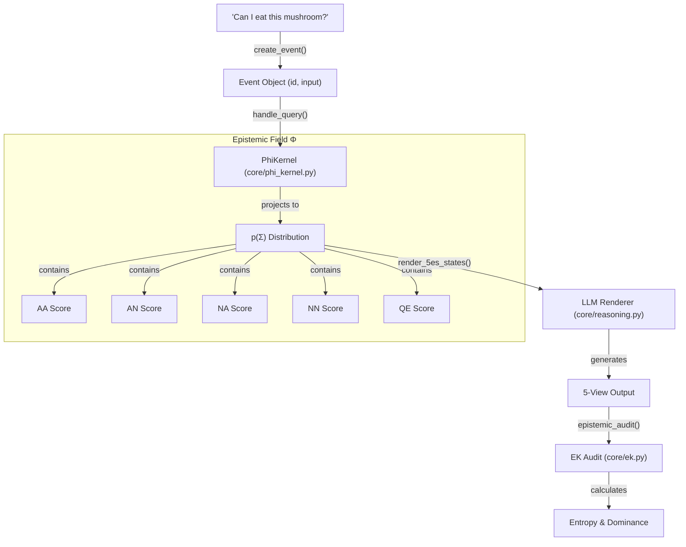

# DeepWiki MCP Integration — Capabilities Report

DeepWiki (https://deepwiki.com) is an AI-powered documentation index built on top of public GitHub repositories. The MCP server exposes that index as three callable tools that any Devin session can use to read structured documentation about a repo and ask grounded questions about its code.

## Tools exposed (3 total)

| # | Tool | Purpose | Required args |
|---|---|---|---|
| 1 | `read_wiki_structure` | Returns the table of contents of the repo's generated wiki — pages and subpages. | `repoName` (`owner/repo`) |
| 2 | `read_wiki_contents` | Returns the **full rendered wiki** for a repo: per-page Markdown with prose, tables, source-file citations, and Mermaid diagrams. | `repoName` (`owner/repo`) |
| 3 | `ask_question` | Free-form QA against one or multiple repos. Returns an AI answer grounded in repo content, with inline citations and links back to relevant wiki pages. | `repoName` (`owner/repo` *or* an array of up to 10), `question` |

All three are read-only and require only a public GitHub `owner/repo` slug — no auth from the caller.

---

## Demo 1 — `read_wiki_structure` on `rischo32/ASIMULATOR`

Returns the page hierarchy as a clean outline. Useful as a cheap first call to decide what to drill into.

```
- 1 ASIMULATOR Overview
  - 1.1 Project Purpose and Philosophy
  - 1.2 Security Policy and Epistemic Integrity
  - 1.3 License, Citation, and Versioning
- 2 Theoretical Foundations
  - 2.1 Epistemic Field Φ (Phi)
  - 2.2 5ES — The Five Epistemic States
  - 2.3 Epistemic Entropy and Dominance
  - 2.4 QE — Qualitative Epistemic Aporia
  - 2.5 Edge Event-Driven Architecture (EEDA)
- 3 System Architecture
  - 3.1 Event Layer: Dispatcher and Handlers
  - 3.2 Phi Kernel and Projection Engine
  - 3.3 Reasoning Layer: 5ES State Rendering
  - 3.4 Epistemic Audit (EK) Layer
  ...
- 9 Glossary
```

(33 pages total across 9 top-level sections.)

---

## Demo 2 — `read_wiki_contents` on `rischo32/ASIMULATOR`

Returns the full body for every page in the structure above, concatenated. In this case it came back as 33 pages / ~4,230 lines of Markdown. Each page begins with a "Relevant source files" block citing the repo files used to generate it, and frequently includes Mermaid diagrams.

Example excerpt — the start of the `ASIMULATOR Overview` page:

> ASIMULATOR™ is a non-authoritative epistemic system designed to prevent the "illusion of knowledge" common in modern AI [README.md:14-23](). Unlike standard Large Language Models that optimize for a single, authoritative answer, ASIMULATOR decomposes every query into a structured distribution of five distinct epistemic states (5ES) [paper.md:5-9](). The system is built on the core philosophy of **Entropic Humility** …

And an embedded architecture diagram pulled directly from that page:



Also includes a 5ES output ontology table extracted from the README:

| State | Name | Description |
|---|---|---|
| **AA** | Aligned Affirmation | Stable, coherent representation (human + field coherent) |
| **AN** | Assertive Noise | Plausible but potentially misleading or speculative |
| **NA** | Negative Alignment | Valid but non-intuitive or critical perspective |
| **NN** | Non-Knowledge | Explicit representation of uncertainty and the unknown |
| **QE** | Qualitative Epistemic Aporia | The boundary state; impossibility of coherent resolution |

---

## Demo 3a — `ask_question` (single repo)

**Repo:** `rischo32/Vectaetos`
**Question:** *"What are the 8 invariant axiomatic centers (Σ) in VECTAETOS and what role does each play?"*

Excerpt of the answer:

> The eight invariant axiomatic centers and their roles are:
> - **INT (Intention / Zámer)**: Represents intention or volition.
> - **LEX (Existence / Existencia)**: Represents law, structure, or logic.
> - **VER (Truth / Pravda)**: Represents truth or reality correspondence.
> - **LIB (Freedom / Sloboda)**: Represents freedom or agency potential.
> - **UNI (Unity / Jednota)**: Represents unity or totality.
> - **REL (Reciprocity / Vzájomnosť)**: Represents relation or reciprocity.
> - **WIS (Wisdom / Múdrosť)**: Represents wisdom or integration.
> - **CRE (Creation / Tvorba)**: Represents creation or emergence.
>
> These axiomatic centers form the topological geometry of meaning within the field… No singularity is dominant, has intrinsic priority, or can be removed, replaced, ranked, optimized, or treated as a goal.

The response also linked back to the wiki pages it was grounded in (`Glossary`, `Formal Definitions: Φ, Σ, R, and the so(8) Lie Algebra`) and to a permalink on deepwiki.com.

## Demo 3b — `ask_question` (multi-repo, cross-cutting)

**Repos:** `["rischo32/Vectaetos", "rischo32/ASIMULATOR"]`
**Question:** *"How do VECTAETOS and ASIMULATOR relate to each other in the Triadic Anchor architecture? Cite specific files or modules where this relationship is encoded."*

Excerpt of the answer:

> In the Triadic Anchor architecture, `VECTAETOS` and `ASIMULATOR` are two distinct repositories with a strictly defined, asymmetric relationship. `VECTAETOS` serves as the ontological root, defining the fundamental field `Φ`, its coherence `K(Φ)`, and the ontological boundary `κ`. `ASIMULATOR` is the procedural layer …
>
> - **Canonical Order and Data Flow**: `VECTAETOS` → `ASIMULATOR` → `ASI_MOD`. Detailed in `TRIADIC_REPOSITORY_ANCHOR.md` and `anchors/CANONICAL_ANCHOR.md`.
> - **Assembly Manifest and Validity Rules**: `ASSEMBLY_MANIFEST.json` specifies that `ASIMULATOR` requires `Vectaetos` for a "Full Boot" and defines forbidden states like `ASIMULATOR_without_Vectaetos`.
> - **Repository Boundaries**: enforced by guard scripts and CI workflows (`anchors/ROOT_CANONICAL_ANCHOR.md`).
> - **Canonical Principles**: `anchors/TRIADIC_ARCHITECTURE_AND_TRIALITY.md` states that `VECTAETOS` is the ontological root and may exist alone, while `ASIMULATOR` may not.

This is the most powerful mode — DeepWiki resolved a question that required reading both repos simultaneously and pointed at the exact filenames where the contract lives.

---

## Capabilities summary

What you can do with the DeepWiki MCP today:

1. **Discover a repo's structure cheaply.** `read_wiki_structure` is the right first call when you don't yet know what's in a codebase — it gives you a navigable outline without paying for the full content.
2. **Read an entire AI-generated wiki.** `read_wiki_contents` returns the full corpus of pages with Markdown, tables, citations to source files (with line ranges, e.g. `[README.md:14-23]`), and Mermaid architecture diagrams. Good for orienting yourself on an unfamiliar repo in one call.
3. **Ask grounded questions about a single repo.** `ask_question` answers in natural language with inline citations into the wiki and links to a sharable DeepWiki search URL.
4. **Ask cross-repo questions.** Pass an array of up to 10 `owner/repo` slugs to `ask_question` to reason across multiple codebases at once — useful for multi-repo architectures (as demonstrated with the Vectaetos ↔ ASIMULATOR triadic anchor question above).
5. **Get shareable permalinks.** Every `ask_question` response includes a `https://deepwiki.com/search/...` URL that you (or a user) can open in a browser to view the same answer with hyperlinked citations.
6. **No auth required from the caller.** All three tools take only public `owner/repo` slugs; the MCP server handles its own GitHub access.

### Practical use cases inside a Devin session

- **Onboarding to an unfamiliar repo** before touching the code — call `read_wiki_structure`, then `read_wiki_contents` or targeted `ask_question`s.
- **Cross-repo architecture questions** ("which repo owns concept X?", "where is the contract between A and B defined?").
- **Locating files by intent** ("where is JWT validation implemented?") without grepping — DeepWiki returns the filename + a citation range.
- **Generating doc summaries / PR descriptions** that need accurate, file-level references.

### Limitations / things to keep in mind

- **Public GitHub repos only.** DeepWiki indexes public GitHub repositories; private repos and other hosts (GitLab, BitBucket, GHES) aren't supported.
- **Index freshness lags.** Answers reflect DeepWiki's last index of the repo, not necessarily the current `HEAD`. For something that needs the freshest code, grep the local clone instead.
- **`read_wiki_contents` can be very large.** For ASIMULATOR it came back at ~4,200 lines / ~33 pages and got auto-spilled to an overflow file. Prefer `read_wiki_structure` + targeted `ask_question` when you only need a slice.
- **Citations are wiki-style, not clickable code links.** Citations like `[README.md:14-23]()` point to filenames + line ranges, but the `()` is intentionally empty — you still need to open the file in your repo (or follow the returned DeepWiki URL) to view the source.
- **Max 10 repos per `ask_question` call.**

In short: DeepWiki MCP is a fast "ask the docs" layer over GitHub. For this workspace it's particularly useful because both repos (`Vectaetos`, `ASIMULATOR`) have substantial generated wikis that already encode the architectural concepts you'd otherwise have to reconstruct from grep.
